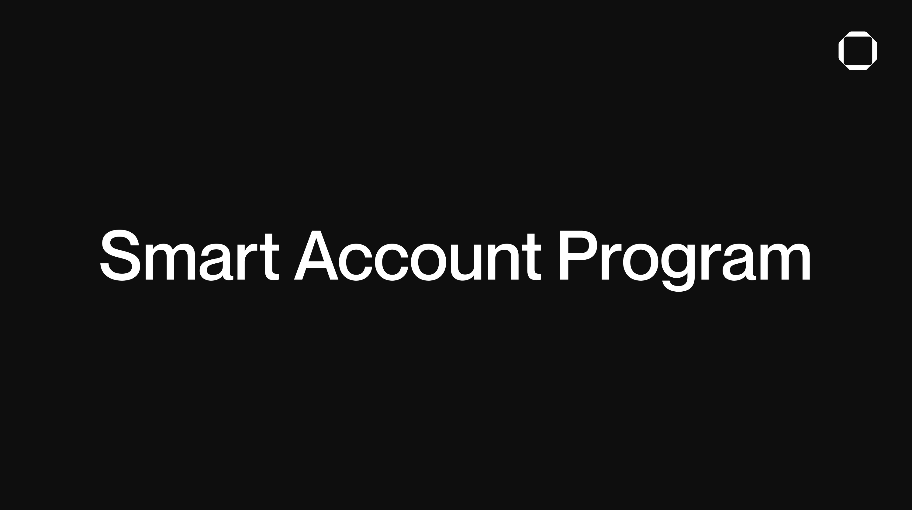

# Squads Smart Account Program v0.1



![license][license-image]
![version][version-image]

[version-image]: https://img.shields.io/badge/version-0.1.0-blue.svg?style=flat
[license-image]: https://img.shields.io/badge/license-AGPL_3.0-blue.svg?style=flat

We are developing the Smart Account Program to address programmability and cost limitations related to deploying smart contract wallets at scale on Solana.

In order to deliver on this promise it builds on the following innovations:

- **Rent free wallet creation**: deploy wallets for as little as 0,0000025 SOL without paying rent until the account needs to execute transactions. Allowing developers to generate addresses for users at scale without worrying about deployment costs.
- **Atomic policy enforcement and transaction execution**: this program empowers developers with optimized smart contract wallets fit for building fully onchain PSPs, stablecoin banks and programmable wallets alike.
- **Archivable accounts**: recoup rent costs from inactive accounts without compromising on security using state compression. Enabling developers to confidently cover fees for their user's accounts by removing the burden of costs associated with inactive users.
- **Policies**: set rules on which an account can execute transactions and extend your account's functionality by creating your own policy programs.

The Smart Account Program is in active development, with regular updates posted on [squads.so/blog](http://squads.so/blog) and [@SquadsProtocol](https://x.com/SquadsProtocol) on X.

## Content

This repository contains:

- The Squads Smart Account v0.1 program.
- The `@sqds/smart-account` Typescript SDK to interact with the smart account program.

## Program (Smart contract) Addresses

The Squads Smart Account Program v0.1 is deployed to:

- Solana Mainnet-beta: `SMRTzfY6DfH5ik3TKiyLFfXexV8uSG3d2UksSCYdunG`
- Solana Devnet: `SMRTzfY6DfH5ik3TKiyLFfXexV8uSG3d2UksSCYdunG`

Both deployments can be verified using the [Ellipsis Labs verifiable build](https://github.com/Ellipsis-Labs/solana-verifiable-build) tool.

## Responsibility

By interacting with this program, users acknowledge and accept full personal responsibility for any consequences, regardless of their nature. This includes both potential risks inherent to the smart contract, also referred to as program, as well as any losses resulting from user errors or misjudgment.

By using a smart account, it is important to acknowledge certain concepts. Here are some that could be misunderstood by users:

- Loss of Private Keys: If a participant loses their private key, the smart account may not be able to execute transactions if a threshold number of signatures is required.
- Single Point of Failure with Keys: If all keys are stored in the same location or device, a single breach can compromise the smart account.
- Forgetting the Threshold: Misremembering the number of signatures required can result in a deadlock, where funds cannot be accessed.
- No Succession Planning: If keyholders become unavailable (e.g., due to accident, death), without a plan for transition, funds may be locked forever.
- Transfer of funds to wrong address: Funds should always be sent to the smart account account, and not the smart account settingsaddress. Due to the design of the Squads Protocol program, funds deposited to the smart account may not be recoverable.
- If the settings_authority of a smart account is compromised, an attacker can change smart account settings, potentially reducing the required threshold for transaction execution or instantly being able to remove and add new members.
- If the underlying SVM compatible blockchain undergoes a fork and a user had sent funds to the orphaned chain, the state of the blockchain may not interpret the owner of funds to be original one.
- Users might inadvertently set long or permanent time-locks in their smart account, preventing access to their funds for that period of time.
- Smart account participants might not have enough of the native token of the underlying SVM blockchain to pay for transaction and state fees.

## Developers

You can interact with the Squads Smart Account Program via our SDKs.

List of SDKs:

- Typescript SDK: `@sqds/smart-account` (not yet published)

## Compiling and testing

You can compile the code with Anchor.

```bash
anchor build
```

To successfully execute `anchor build` for this project, you must have Solana CLI version 1.18.16 (`solana-cli 1.18.16`) installed.

### How to Check Your Solana Version

```bash
# Run the following command:
solana --version
```

If your version is not `1.18.16`, you need to switch to the required version.

### How to Switch Solana CLI Version

Use the Agave installer to initialize the correct version:

```bash
agave-install init 1.18.16
```

### Installing Anchor

If you do not have the Solana Anchor framework CLI installed, you can do so by following [this guide](https://www.anchor-lang.com/docs/installation).

To deploy the program on a local validator instance for testing or development purposes, you can create a local instance by running this command from the [Solana CLI](https://docs.solana.com/cli/install-solana-cli-tools).

```bash
solana-test-validator
```

To run the tests, first install the node modules for the repository.

```bash
yarn
```


And run these tests with this command:

```bash
yarn test
```

### Verifying the code

First, compile the programs code from the `Squads-Protocol/smart-account-program` Github repository to get its bytecode.

```bash
git clone https://github.com/Squads-Protocol/smart-account-program.git
```

```bash
anchor build
```

Now, install the [Ellipsis Labs verifiable build](https://crates.io/crates/solana-verify) crate.

```bash
cargo install solana-verify
```

Get the executable hash of the bytecode from the Squads program that was compiled.

```bash
solana-verify get-executable-hash target/deploy/squads_smart_account_program.so
```

Get the hash from the bytecode of the on-chain Squads program you want to verify.

```bash
solana-verify get-program-hash -u <cluster url> SMRTe6bnZAgJmXt9aJin7XgAzDn1XMHGNy95QATyzpk
```

If the hash outputs of those two commands match, the code in the repository matches the on-chain programs code.

## Security

The Squads Smart Account Program has been audited by Ottersec and Certora and additionally formally verified by Certora.

- Certora FV & Audit: [View Full Report](./audits/certora_smart_account_audit+FV.pdf)
- Ottersec Audit: (coming soon)

## License

The primary license for Squads Smart Account Program is the AGPL-3.0 license, see [LICENSE](./LICENSE). The following exceptions are licensed separately as follows:

- The file <https://github.com/Squads-Protocol/smart-account-program/blob/main/programs/squads_smart_account_program/src/utils/system.rs> is derived from code released under the [Apache 2.0 license](https://github.com/coral-xyz/anchor/blob/master/LICENSE) at <https://github.com/coral-xyz/anchor/blob/714d5248636493a3d1db1481f16052836ee59e94/lang/syn/src/codegen/accounts/constraints.rs#L1126-L1179>.
- The file <https://github.com/Squads-Protocol/smart-account-program/blob/main/programs/squads_smart_account_program/src/utils/small_vec.rs> is derived from code released under both the [Apache 2.0 license](https://github.com/near/borsh-rs/blob/master/LICENSE-APACHE) and the [MIT license](https://github.com/near/borsh-rs/blob/master/LICENSE-MIT) at <https://github.com/near/borsh-rs/blob/master/borsh/src/de/hint.rs> and <https://github.com/near/borsh-rs/blob/master/borsh/src/ser/mod.rs>.

To the extent that each such file incorporates code from another source, such code is licensed under its respective open source license as provided above, and the original open source code is copyrighted by its respective owner as provided above.
